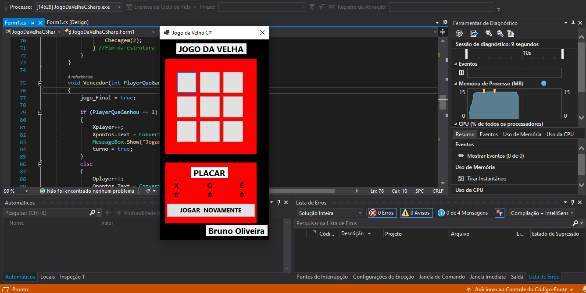
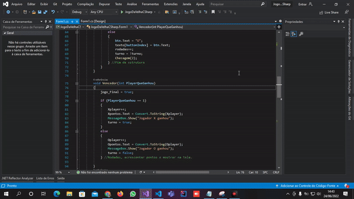

## JogoDaVelhaCSharp ##

# Imagem programa em execução.

        

# Gif programa em execução.

        

## Descrição do Programa
Um programa desenvolvido com VisualStudio 2019, utilizando WindowsForms juntamente com a utilização de alguns métodos e funções, e aprendendo um pouco sobre Matriz.

